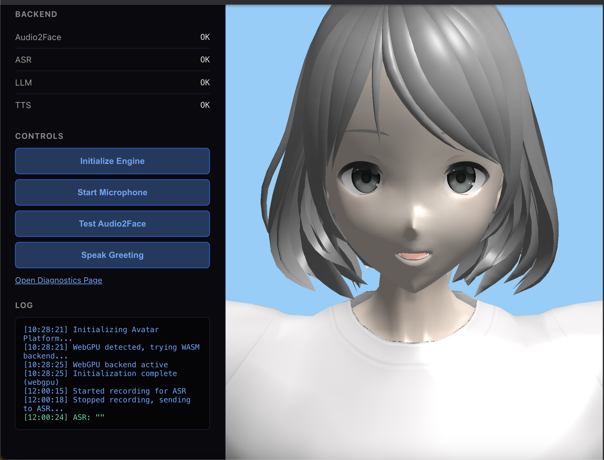

# WebGPU Avatar Client

A browser-based, GPU-accelerated 3D avatar engine with real-time speech-driven facial animation. Renders a VRM/GLB avatar model using WebGPU compute shaders (with WebGL2 fallback) and drives lip-sync via NVIDIA Audio2Face-3D blendshape streams.



## Features

- **WebGPU + WebGL2 fallback** — GPU-accelerated morph-target deformation via WGSL compute shaders; falls back to CPU deformation + WebGL2 if WebGPU is unavailable
- **Real-time lip-sync** — Streams audio to NVIDIA Audio2Face-3D NIM and receives per-frame blendshape weights (52 ARKit-compatible shapes)
- **Conversational AI pipeline** — Push-to-talk → ASR → LLM (vLLM/Qwen) → TTS → A2F → avatar animation
- **Riva TTS integration** — Text-to-speech via NVIDIA Riva with gRPC-Web streaming
- **Microphone streaming** — Capture browser audio and stream raw PCM16 to backend at 16kHz
- **Head-only rendering** — Auto-filters full-body GLB to head/face primitives for performance

## Architecture

```
Browser (this repo)
  ├─ WebGPUAvatarRenderer / WebGL2AvatarRenderer
  ├─ AvatarApp (main controller)
  ├─ RivaTTSClient (gRPC-Web → Envoy → Riva)
  ├─ Audio2FaceClient (gRPC-Web → Envoy → A2F NIM)
  └─ AudioWorklet (mic capture → PCM16)

Backend (not included — bring your own)
  ├─ NVIDIA Audio2Face-3D NIM  (gRPC, port 50051)
  ├─ NVIDIA Riva Speech        (gRPC, port 50051)
  ├─ vLLM / OpenAI-compatible LLM  (HTTP, port 8000)
  └─ Envoy Proxy               (gRPC-Web bridge)
```

## Quick Start

### 1. Serve the client

The client is static HTML/JS. Serve it with any web server:

```bash
# Python
cd src && python3 -m http.server 8080

# Node.js
npx serve src

# nginx
# Copy src/ to /usr/share/nginx/html
```

### 2. Configure backend endpoints

Edit `src/app.js` and set your backend URLs (or use the same-origin proxy approach):

```javascript
// In AvatarApp constructor (~line 20)
this.config = {
    a2fProxyUrl:    'https://your-envoy-proxy/v1/audio2face',
    rivaTtsUrl:     'https://your-envoy-proxy/riva/tts',
    asrUrl:         'https://your-envoy-proxy/api/asr',
    chatUrl:        'https://your-envoy-proxy/api/chat',
    healthUrl:      'https://your-envoy-proxy/api/health',
    avatarModel:    '/avatar.glb'
};
```

### 3. Open in Chrome Canary

Chrome Stable does **not** support the WebGPU features required. Use **Chrome Canary** with these flags:

```bash
/Applications/Google\ Chrome\ Canary.app/Contents/MacOS/Google\ Chrome\ Canary \
  --enable-unsafe-webgpu \
  --enable-features=WebGPU \
  --ignore-gpu-blocklist
```

Navigate to `http://localhost:8080` and click **"Initialize Engine"**.

## Backend Setup (required)

### NVIDIA Audio2Face-3D NIM

Deploy the A2F-3D NIM container:

```bash
docker run --gpus all -p 50051:50051 \
  nvcr.io/nvidia/audio2face-3d:1.0 \
  --grpc-port 50051
```

### Envoy Proxy (gRPC-Web bridge)

The browser cannot speak raw gRPC. Envoy translates gRPC-Web ↔ gRPC:

```yaml
# envoy.yaml
static_resources:
  listeners:
    - address:
        socket_address: { address: 0.0.0.0, port_value: 8080 }
      filter_chains:
        - filters:
            - name: envoy.filters.network.http_connection_manager
              typed_config:
                "@type": type.googleapis.com/envoy.extensions.filters.network.http_connection_manager.v3.HttpConnectionManager
                codec_type: AUTO
                stat_prefix: ingress_http
                route_config:
                  virtual_hosts:
                    - name: a2f
                      domains: ["*"]
                      routes:
                        - match: { prefix: "/nvidia.ace.a2f.v1proto.Audio2Face" }
                          route:
                            cluster: a2f
                            timeout: 0s
                            max_stream_duration:
                              grpc_timeout_header_max: 0s
                http_filters:
                  - name: envoy.filters.http.grpc_web
                  - name: envoy.filters.http.cors
                  - name: envoy.filters.http.router
  clusters:
    - name: a2f
      connect_timeout: 5s
      type: STRICT_DNS
      lb_policy: ROUND_ROBIN
      typed_extension_protocol_options:
        envoy.extensions.upstreams.http.v3.HttpProtocolOptions:
          "@type": type.googleapis.com/envoy.extensions.upstreams.http.v3.HttpProtocolOptions
          upstream_protocol_options:
            explicit_http_config:
              http2_protocol_options: {}
      load_assignment:
        cluster_name: a2f
        endpoints:
          - lb_endpoints:
              - endpoint:
                  address:
                    socket_address: { address: a2f-nim, port_value: 50051 }
```

### Riva Speech

Deploy Riva ASR + TTS (requires NVIDIA GPU):

```bash
# Follow NVIDIA Riva quickstart:
# https://docs.nvidia.com/deeplearning/riva/user-guide/docs/quick-start-guide.html
```

**Note:** Riva ASR uses TensorRT which requires CUDA Virtual Memory Management. This is **not supported** on vGPU profiles (e.g., A40-24Q). For vGPU environments, use a CPU-based ASR alternative such as faster-whisper.

### LLM (vLLM / OpenAI-compatible)

Any OpenAI-compatible endpoint works. Example with vLLM:

```bash
python -m vllm.entrypoints.openai.api_server \
  --model Qwen/Qwen3.6-35B-A3B-FP8 \
  --tensor-parallel-size 1 \
  --port 8000
```

## Project Structure

```
.
├── README.md
├── assets/
│   └── avatar.glb              # Sample avatar model (head + body, ~23MB)
└── src/
    ├── index.html              # Main UI (viewport, controls, chat panel)
    ├── app.js                  # AvatarApp controller (init, pipeline, UI)
    ├── webgpu_renderer.js      # WebGPU backend (WGSL compute, PBR)
    ├── webgl2_renderer.js      # WebGL2 fallback (CPU morph, basic PBR)
    ├── a2f-client.js           # Audio2Face gRPC-Web client
    ├── riva-tts-client.js      # Riva TTS gRPC-Web client
    ├── audio-worklet.js        # Microphone PCM16 capture
    ├── personaplex-client.js   # Moshi/PersonaPlex integration stub
    └── diag.html               # Diagnostics page
```

## Browser Compatibility

| Browser        | WebGPU | Status |
|----------------|--------|--------|
| Chrome Canary  | Yes    | Fully supported (requires flags) |
| Chrome Stable  | Yes    | Partial — may need `--enable-unsafe-webgpu` |
| Firefox        | No     | WebGL2 fallback only |
| Safari         | No     | WebGL2 fallback only |

## Key Files

### `src/app.js`
Main application class. Handles:
- WebGPU / WebGL2 initialization
- Avatar model loading (`avatar.glb`)
- Microphone capture → A2F streaming
- TTS synthesis → audio playback
- Push-to-talk conversational loop (ASR → LLM → TTS → A2F)
- Backend health polling

### `src/webgpu_renderer.js`
WebGPU renderer with:
- WGSL compute shader for morph-target deformation
- PBR material pipeline (metallic/roughness, normal maps, IBL)
- Head-only primitive filtering
- Auto-camera centering on face region

### `src/webgl2_renderer.js`
WebGL2 fallback with:
- CPU-based morph target blending
- Basic PBR shader (no compute)
- Same mesh/texture loading as WebGPU path

### `src/a2f-client.js`
gRPC-Web client for NVIDIA Audio2Face-3D. Handles:
- Bidirectional streaming (`PushAudioStream`)
- Blendshape weight extraction per frame
- Automatic stream lifecycle management

## Customization

### Swap Avatar Model

Replace `assets/avatar.glb` with your own GLB/VRM model. The renderer expects:
- Morph targets (blendshapes) named in ARKit convention: `eyeBlinkLeft`, `jawOpen`, `mouthSmileLeft`, etc.
- PBR materials with baseColor, metallicRoughness, normal, and emissive textures
- Full-body models are auto-filtered to head-only at Y > 0.81 (tune in `webgpu_renderer.js`)

### Adjust Camera

In `webgpu_renderer.js`, modify the auto-centering logic:

```javascript
// Auto-centered camera (line ~125 in init())
const center = [(min[0]+max[0])/2, min[1] + bodyHeight * 0.55, (min[2]+max[2])/2];
```

Change `0.55` to adjust vertical focus (0.72 = hairline, 0.55 = nose/eyes).

### Backend Endpoints

Search for `this.config` in `app.js` to change all backend URLs.

## License

MIT — see LICENSE file.

## Acknowledgements

- NVIDIA Audio2Face-3D NIM
- NVIDIA Riva Speech
- vLLM project
- Qwen (Alibaba Cloud)
